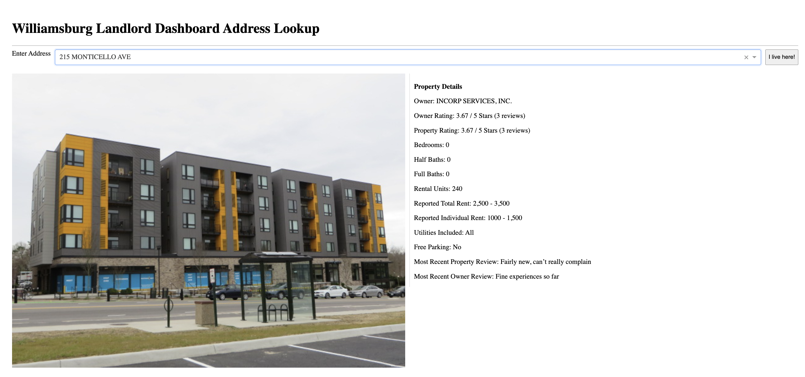

# Williamsburg Landlord Project
**Nico Rapallo**\
**Professor Smith**\
**DATA 440: Automations and Workflows**\
**May 2024**
---
## Overview

This repository contains a relational database with information relating to all the rental properties located in the City of Williamsburg, as well as a dash user interface to navigate properties and leave your own review (stored locally). The repository also includes code that was used in scraping and cleaning the original data and creating the sqlite database.

This project was inspired by experiences with my own landlord and conversations with other students about their experiences. The goal is to create a place where Williamsburg renters can leave a review on their landlord and to connect reviews on different properties which are owned by the same person (even if they have set up different companies).

---
## Quick Start

### Clone repository (Warning may take a few minutes):
```bash 
git clone https://github.com/Nico-Rapallo/LandlordProject
```

### Sync UV environment:
```bash
uv sync
```

### Run main.py:
```bash
uv run main.py
```

### Open url in browser: 
```bash
http://127.0.0.1:8050/
```

### Search addresses in the address bar and leave a review by clicking the "I Live Here" button!

---

## Data Sources

### City of Williamsburg parcel usage data and property cards
#### City Website for parcel usage data:
```bash
https://www.williamsburgva.gov/310/Real-Estate-Assessment
```
Navigate to `FY2026 Assessment Report (Parcel Usage)`
### City of Williamsburg GIS page with property cards:
```bash
https://gis.williamsburgva.gov/portal/apps/webappviewer/index.html?id=7ae0e03b343241fa9b89cb2aa3776628
```
### State Corporation Commission Clerk's Information System 
```bash
https://cis.scc.virginia.gov/EntitySearch/Index
```

### Survey Data
Survey for landlord reviews conducted April - May 2025 used for initial responses, which populate the database.

---

## Files included

`src/`
- main.py

- Landlord.py: Code for creating and querying landlord.sqlite.
    - class Base_DB()
        - Contains base code for creating and querying database.
        - Provided by Professor Smith in DATA 302 Databases.
    - class Landlord_DB()
        - Contains code for creating landlord database. 
        - Contains specific functions that query the database to get information for the dashboard.
        - Contains function to insert a new response.

- `dash_code/`: Contains code for dash interface
    - dashboard.py: Creates dash web app. Base code via Professor Smith.
        - def create_layout(): Creates layout for app.
        - def update_property_display(): Updates image/details page when address changes.
        - def swap_views(): Swaps visibility of image/details page and form page.
        - def toggle_submit_button(): Ensures all fields are filled to press the submit button.
        - def submit_review(): Submits review.
- `data/`
    - landlord.sqlite: Database used to store information.
    - load_database.pynb: Code used for initial database creation (Should not be run again)
    - tOwner.csv, tProperty.csv, and tResponse: Cleaned tables inserted into database
    -`property_data/`
        - `image_data/`: Where images of every house are stored. (Why it took a few minutes to clone the repository).
         - FY2026 Assessment Report (Parcel Usage).xlsx: Original property data file
    -`data_cleaning/`: All code related to cleaning the data.
    -`company_data/`: Original data files for company data. (Some removed because of size constraint)
    -`response_data/`: Original survey data (34 responses with a little over half having valid addresses)
    
---

## Limitations to Note While Using (or Why is My Address Not Showing Up?)
- For apartments, mailing addresses are not always the same as the address listed on the City of Williamsburg property card, which is a potential source for confusion. For example, Midtown is stored in the database under 215 Monticello Ave instead of 221 Monticello Ave.
- Sometimes multiple houses or apartments will be listed under the same property ID if they are adjacent and have the same owner. This leads to a situation where a house might be listed under the address of the mixed-use/residential building next door.
- The database includes properties located in the City of Williamsburg, which does not include the entire Williamsburg housing market, as many students live in James City and York counties. 
- The database only includes addresses officially listed as rentals, multi-family, or apartments, so any property that is incorrectly labeled as not being a rental is not included in the database.
- Some properties may be owner by the same landlord, but because of property ownership by different companies and limitations in my data collection, they may not be connected.
- Bedroom and bathroom data seems to be incorrect on some multi-unit buildings and apartment buildings.

---

## Libraries and References
### References
- Professor Ron Smith
- https://medium.com/@alexaae9/python-how-to-extract-images-from-pdf-documents-9492a767a613
- https://www.geeksforgeeks.org/working-with-pdf-files-in-python/

### Libraries
- Dash
- Pandas
- NumPy
- Plotly
- Spire
- Levenshtein
- pypdf
- sqlite3
- shutil
- urllib
- datetime
- regex
- os
- zipfile

---
This project is maintained using the uv package manager.
